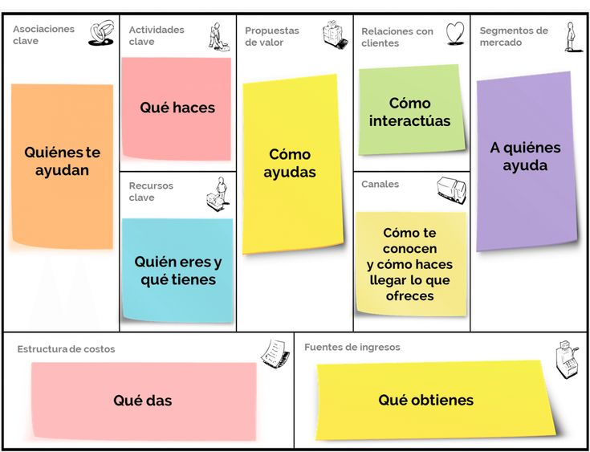

# Taller de Portfolio

> **MATERIAL PARA ALUMNOS DE DATA SCIENCE**
> 

> **THE BRIDGE | DIGITAL TALENT ACCELERATOR**
> 

### Autor:

Marta Gómez Jiménez **TA Data Science**

- **Contacto**
    
    🐱 Github
    
    [martagomezz - Overview](https://github.com/martagomezz)
    
    🖇️ LinkedIn 
    
    [Marta Gómez Jiménez - Data Science TA - The Bridge | Digital Talent Accelerator | LinkedIn](https://www.linkedin.com/in/martagomezjimenez/)
    

---

# Personal Branding

> “Todos libramos batallas en las que intervienen dos voces: una se llama confianza y la otra miedo.” ― **Joshua A. Aguilar, [El Millonario de Silicon Valley](https://www.amazon.es/millonario-Silicon-Valley-Joshua-Aguilar-ebook/dp/B07DYJXCYH)**
> 

- Storytelling, enamora.
    
    [https://youtu.be/FU-CScxkYwc](https://youtu.be/FU-CScxkYwc)
    

- Crea tu marca, destaca de los demás.
    
    
    

---

# ¿Qué incluir en el portfolio?

Todo lo que tenga que ver con **proyectos personales. NO incluir ejercicios de clase**. 

1. Trabajos personales del bootcamp
2. Hackathones/Datathones
3. Analíticas personales. Por ejemplo, descargarse los datos de COVID de alguna página del gobierno y realizar una analítica sobre su evolución o impacto por comunidad autónoma.
4. Competiciones de Kaggle.
5. El CV. Si vas a crear una página con tus proyectos, acuérdate de incluir un apartado con tus habilidades, formación y experiencia laboral.

Intenta mantener el portfolio actualizado con tus proyectos o artículos. Si tienes un portfolio en un página web, no tiene por qué ser sólo de tus proyectos, podrías tener un blog donde cuentes tus experiencias, habilidades o descubrimientos como Data Scientist o cualquier otro tema relacionado que te sirva para llegar a la audiencia y ser un experto en la materia.

👨🏻‍💻 En [este artículo](https://towardsdatascience.com/how-to-build-a-data-science-portfolio-5f566517c79c) tienes muy buenos consejos sobre cómo crear tu perfil público como Data Scientist.

---

# Proyectos durante el Bootcamp

Durante estas **14 semanas** has realizado nada más y nada menos que **10 proyectos personales** en los que has demostrado, desde tu **evolución** paquetizando y desarrollando funciones en **Python**, hasta todo el abanico de **librerías** que conoces y eres capaz de utilizar como **Data Scientist**.

- **Python & Numpy Hundir la flota**
- **EDA**
- **Diseño y despliegue BBDD**
- **Competiciones de** **Kaggle**:
    - Modelo de **regresión** para calcular el precio de los ordenadores.
    - Modelo de **clasificación** para concesión de créditos bancarios.
    - Tratamiento de **imágenes** para detectar el sentimiento de imágenes de caras.
- **Proyecto Machine Learning**
- **Proyecto Despliegue ChatGPT**
- **Desafío de tripulaciones**

    

---

# Haz tu portfolio

Hay diferentes plataformas desde las que podemos crear un portfolio, pero a la hora de elegir con cuál elegir deberemos poner en una balanza tiempo vs portfolio trabajado. Desde dedicarle una mañana (hoy), a una semana de trabajo, únicamente para crear el portfolio/blog. 

- **Plataformas**
    1. **GitHub:** directamente en GitHub, crear un repositorio donde tengas los proyectos por carpetas y documentados en Markdown. Rápido.
        
        [GitHub: Where the world builds software](https://github.com/)
        
    2. **Notion**: documentar tus proyectos en Notion y enlazar con los repositorios de Github. Esta opción es más flexible porque puedes añadir otro tipo de proyectos y enlazar artículos que tengas en otras plataformas. 
        
        [https://www.notion.so/](https://www.notion.so/)
        
    3. **GitHub Pages**: con cuatro clicks (literalmente) puedes crear una página web estática en el propio GitHub. Sencilla, pero que para un blog/portfolio nos sirve. La tecnología que lleva por debajo es Jekyll + Ruby. Desde cero lleva tiempo.
        
        [GitHub Pages](https://pages.github.com/)
        
    4. **Jekyll Now**: Es una manera sencilla de crear GitHub Pages con Jekyll. Básicamente es una plantilla con todo el front ya creado. Sólo hay que hacer un fork desde GitHub, y empezar a personalizarlo en el propio GitHub o en local. Requiere de aprendizaje pero el resultado es muy bueno para el tiempo dedicado.
        
        [Acerca de las Páginas de GitHub y Jekyll - GitHub Docs](https://docs.github.com/es/pages/setting-up-a-github-pages-site-with-jekyll/about-github-pages-and-jekyll)
        
    5. **Glitch**: página donde publicar tus proyectos o tu CV. Es bastante rápido crearte un perfil mediante una plantilla. En [este artículo](https://towardsdatascience.com/how-to-create-an-elegant-website-for-your-data-science-portfolio-in-10-minutes-577f77d1f693) tienes una buena guía. 
    6. **Google site:** aplicación gratuita, incluida en Google Suite para la creación de páginas web.
        
        [Descubre Google Drive: un lugar para todos tus archivos](https://sites.google.com/new?hl=es)
        
    7. **Otras opciones**: si buscas hacer un portfolio más extenso, que incluya tu propio blog, te recomendamos los clásicos [WordPress](https://es.wordpress.com/) o [Wix](https://es.wix.com/) para crear tu página web personal. Esta última opción, no solo requiere de mucho tiempo para tener algo decente y atractivo, también necesitará que le reserves tiempo de forma recurrente para alimentarlo y tenerlo actualizado. 
    
- **Inspiración**
    1. **Notion →** [Marta Gómez Jiménez](https://www.notion.so/Marta-G-mez-Jim-nez-78f2014bf981488f94a91df5dd37b168?pvs=21) 
    2. **Github**
        
        [JuanManiglia - Overview](https://github.com/JuanManiglia)
        
    3. **Github Page**
        
        [Juan Maniglia | Home](https://juanmaniglia.github.io/)
        
        [Antonio Jimenez](https://ajimenezadalia.github.io/)
        
    4. **Google Sites**
        
        [Antonio Jiménez](https://sites.google.com/view/ajimenezadalia/inicio)
        
    5. **Wordpress**
        
        [home - mabatalla | Data science](https://miguelangel.batalla.pro/)
        
    6. **Web** profesional con **blog** 
        
        [Ander Fernández Jauregui - Data Science & Business Intelligence](https://anderfernandez.com/)